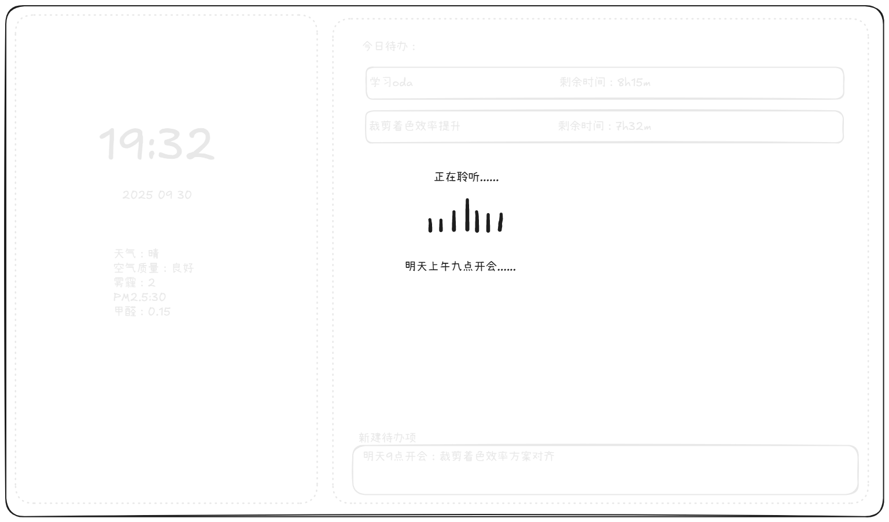

# Grateful Assistant

[](LICENSE)
[](https://en.cppreference.com/)


Grateful Assistant 是一个基于 C++/Qt6 的多功能桌面助理应用，内置待办事项、天气信息、语音交互与 AI 助手能力，强调即时可用、可扩展与高性能。

- 核心优势：模块化内核（Kernel + Service + GUI）、可插拔 Provider（AI/Weather）、跨平台构建（CMake）、可视化界面（Qt6 Widgets）。
- 技术亮点：事件总线、序列化配置（JSON）、资源打包（Qt Resource）、可选共享/静态库构建。

## 🚀 快速开始（5 分钟）

适用于 Linux/macOS/Windows，以下以 Linux 为例。

```bash
# 安装依赖（示例）
# Qt6、CMake、C++17 编译器需已安装；可选 vcpkg 管理包

# 构建与运行（纯 CMake）
mkdir -p build && cd build
cmake .. -DCMAKE_BUILD_TYPE=Release
cmake --build . -j
./bin/grateassistant
```

若提示 Qt6 未找到，请设置 `Qt6_DIR` 环境变量指向 Qt 安装目录（详见 docs/configuration.md）。

## 功能特性

| 功能 | 描述 | 状态 |
|---|---|---|
| 待办事项（Todo） | 创建/编辑/删除、优先级管理与列表展示 | ✅ 已实现 |
| 天气信息（Weather） | 显示每日天气与城市选择 | ✅ 已实现 |
| 语音交互（Voice） | 唤醒词校验、录音状态提示与内容显示 | ✅ 已实现 |
| AI 助手（AI Assistant） | Provider/Model 管理、参数配置与消息显示 | ✅ 已实现 |
| 名言/新闻扩展 | 可扩展服务位，支持后续集成 | ☑️ 规划中 |
| 主题与样式 | 暗/亮主题（QSS），资源打包 | ✅ 已实现 |

效果截图：




## 基础用法示例

C++ 代码片段（显示主窗口）：

```cpp
#include <QApplication>
#include <gui/MainWindow.h>

int main(int argc, char** argv) {
    QApplication app(argc, argv);
    MainWindow w;
    w.show();
    return app.exec();
}
```

运行后将看到时间、天气（左侧）与待办列表（右侧）的布局，语音录音层按唤醒词显示/隐藏。

## 👥 贡献指南（开发环境）

- 必需：`Qt6 Widgets/Core`、`CMake >= 3.30`、`C++17` 编译器。
- 可选：`vcpkg`（依赖：`fmt`、`nlohmann-json`、`spdlog`、`sqlite3`、`portaudio`、`poco` 等，见 vcpkg.json）。
- 构建：`cmake -S . -B build -DCMAKE_BUILD_TYPE=Debug`；运行：`./build/bin/grateassistant`。
- 开关选项：见 `cmake/options.cmake`（例如 `BUILD_SHARED_LIBS=ON`、`BUILD_AI_PROVIDERS=ON` 等）。

提交前：确保可编译与运行，若引入新模块请在 `docs/api.md` 与 `docs/architecture.md` 更新说明。

## 📚 文档索引

- API 文档：`docs/api.md`
- 高级配置：`docs/configuration.md`
- 常见问题：`docs/faq.md`
- 架构设计：`docs/architecture.md`
- 性能优化：`docs/performance.md`
- UI 设计：`docs/界面设计.md`

## 🧩 术语对照

- Provider（提供者）：AI/天气等外部服务封装。
- Model（模型）：Provider 下具体可用模型配置。
- Service（服务）：应用内功能模块（如 todo、weather）。
- Event Bus（事件总线）：模块间消息分发机制。

## 📄 许可证

MIT License，详见 `LICENSE`。


> 文档版本与代码版本同步：v0.1.0（请在发版时同步更新）。
