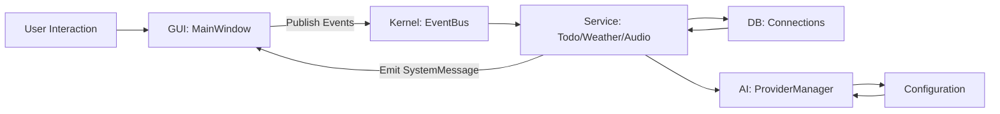
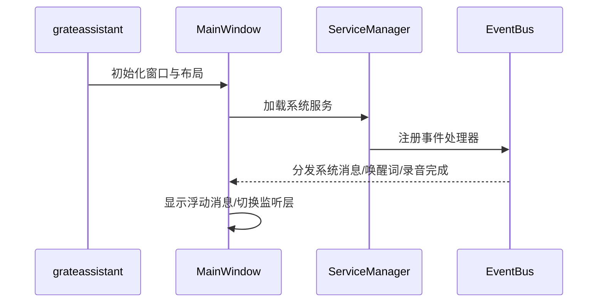

# 🏗️ 架构设计说明（v0.1.0）

Grateful Assistant 采用模块化架构，核心由 Kernel、GUI、AI、DB、Service 构成，通过事件总线解耦交互。

## 总览
- Kernel：配置、事件总线、服务管理与基础接口。
- GUI：主窗口与功能卡片（时间、天气、待办、语音层）。
- AI：Provider/Model 管理，序列化参数到配置。
- DB：持久化与数据连接（Todo/模型信息等）。
- Service：功能服务抽象（todo、weather、audio、sync...）。

## 目录结构映射
- `include/`：公共头文件
- `source/`：实现代码（`app`、`gui`、`kernel`、`ai`、`db`、`service`）
- `resource/`：样式、图标、字体与资源文件

## 交互流程（Mermaid）

## 启动流程（Mermaid）

## 关键设计点
- 事件驱动：通过 `EventBus` 与 `Events` 定义跨模块通信。
- 配置序列化：`Configuration` 支持 JSON 路径读写与数组追加。
- 可插拔扩展：`BUILD_AI_PROVIDERS` / `BUILD_WEATHER_PROVIDERS` 控制扩展编译。
- 资源打包：使用 Qt `AUTORCC` 与 `res.qrc` 嵌入资源。

## 依赖与构建
- Qt6 Widgets/Core、CMake 3.30+、C++17 编译器。
- vcpkg（可选）：`fmt`、`nlohmann-json`、`spdlog`、`sqlite3`、`sqlite-orm`、`portaudio`、`poco`、`openssl`、`cpp-httplib`。

## 扩展模式
- 新增 Service：实现 `IService` 接口并在 `ServiceManager` 注册。
- 新增 Provider：实现 `Provider` 派生类，注册至 `ProviderManager` 并写入 `Configuration`。